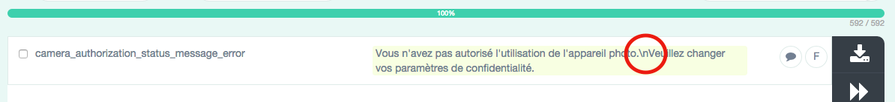
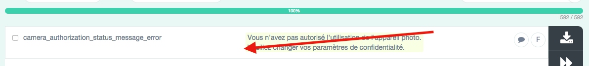
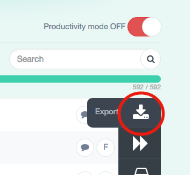

# POEditor

Ce repository contient l'ensemble des **scripts**, **outils**, pages de **documentation** nécessaires à la **génération** des strings (wordings) `iOS` et `Android` :

* `POEditor` ~> Le générateur de strings (wordings) **iOS** et **Android**

> Cet outil permet de générer à partir des fichiers de strings exportés depuis `POEditor` les fichiers de strings **iOS** (`Localizable.strings`) et **Android** (`strings.xml`), en opérant une opération de nettoyage des strings spécifiques à une des plateformes.

---

## Installation

L'outil peut être invoqué en direct après ajout au `PATH` de votre environnement du répertoire `bin` contenu dans `POEditor`, ou en précisant le chemin complet vers le script Ruby exécutable `poeditor` contenu dans ce même répertoire `bin`.

Plusieurs options de ligne de commande peuvent être utilisées lors de l'invocation de cet outil :

```
➜ ✗ poeditor -h
Usage: poeditor [options]
    -a, --apple PATH          Specify Apple strings file path
    -d, --android PATH        Specify Android strings file path
    -z, --localizable PATH    Specify iOS Localizable.strings file path
    -x, --xml PATH            Specify Android strings.xml file path
    -h, --help                Show this message
    -v, --version             Show version
```

## Processus d'utilisation

Vous avez besoin d’un string **qui se traduit !!!** dans votre projet **iOS** et **Android** ?

### 1) Existe-t-il déjà ?

1) Regarder si la valeur (la traduction) n’existe pas déjà dans le fichier de strings de votre projet :

* `Localizable.strings` pour iOS
* `strings.xml` pour Android

Si oui, utilisez la clé correspondante dans votre `layout xml`, `storyboard`, `xib` ou fichier source, et c’est fini !!!

> **NB:** Il est important de ne pas dupliquer des traductions similaires (avec des clés différentes) pour éviter de devoir traduire plusieurs fois les mêmes termes.

Si non, il faut ajouter un nouveau terme dans l'outil `POEditor`.

### 2) Ajout dans `POEditor`

Se connecter sur [POEditor](https://poeditor.com) avec le compte suivant identifié à cette [page](http://redmine-niji/redmine/projects/niji-outils-transverses/wiki/Poeditor_compte). Ce compte est à utiliser pour tous les projets :

* Login : **poeditor@niji.fr**
* Password : **EDp12L!?**

> **NB:** Seul ce compte permet d’ajouter des nouveaux termes

### 3) Ajouter le nouveau terme

* Utilisez le `_` comme séparateur
* Trouver un nom de clé **cohérent** avec les clés existantes

**Exemples :**
> 
> Si vous ajoutez une clé qui concerne les documents, nommez là
> `documents_xxxxxxx_xxxx_xx` ou `document_xxx_xxx_xxxxx`.
> 
> Si vous ajoutez un terme assez générique comme **Appuyer**, nommez la clé `action_push` par exemple.

* Suffixez par `_ios`, `_ios(+)` ou `_android` toute clé d’un terme qui contient un **format** ou qui est un **pluriel**.

**Exemples :**

```
// iOS
"credentials_message_confirm_ios" = "Vous allez recevoir un e-mail à l'adresse %@ vous invitant à définir un nouveau code secret.\nMerci de consulter vos e-mails.";
"document_add_gallery_selected_text_%i_ios" = "%i sélectionnée";
"document_add_gallery_selected_text_%i_ios(+)" = "%i sélectionnées »;

// Android
<string name="documents_add_date_android">"Le %1$s à %2$s"</string>
<string name="home_upload_again_confirmation_document_android">"Votre document %1$s n'a pas pu être ajouté.\nVoulez-vous poursuivre l'ajout de ce document ?"</string>
<plurals name="trash_restore_documents_android">
    <item quantity="one">"Confirmez-vous la restauration de cet élément ?"</item>
    <item quantity="other">"Confirmez-vous la restauration de ces %d éléments ?"</item>
</plurals>
```

> **NB:** Concernant les traductions, depuis `POEditor`, bien insérer les retours à la ligne avec `\n` et non avec la touche Entrée de votre clavier.
> 
> **NB:** Il n'est pas nécessaire d'échapper sur Android les caractères spéciaux type `'`.

**DO**



**DON'T**



### 4) Exporter le(les) fichier(s) de strings

Exporter le(les) fichier(s) de strings (**iOS** et/ou **Android**) depuis `POEditor`.



Les fichiers suivants sont enregistrés normalement sur votre disque :

* `Digiposte_Pass_French.xml` (pour Android)
* `Digiposte_Pass_French.strings` (pour iOS)

### 5) Exécution du script

Exécuter le script Ruby `poeditor` qui **nettoie** et **overwrite** les fichiers de strings dans le projet **Xcode** et **Android Studio**.

**Exemple** :

```
➜ ✗ poeditor -a /Users/KiKi/Downloads/Digiposte_Pass_French.strings -z /Users/KiKi/Documents/Dev/GitLab/LaPoste/Pass-iOS/DigiPoste-PortefeuilleNumerique/Resources/Data/fr.lproj/Localizable.strings -d /Users/KiKi/Downloads/Digiposte_Pass_French.xml -x /Users/KiKi/Documents/Dev/GitLab/LaPoste/Pass-Android/app/src/main/res/values/strings.xml
```

> **NB:** Ce script nettoie les fichiers exportés de POEditor et va directement les écrire dans vos projets respectifs.
