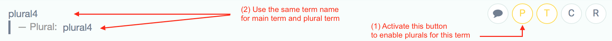

# POEditor

This repository contains a script to generate `iOS`' and `Android`'s localized strings files extracted from a [poeditor.com](https://poeditor.com) project:

Using [poeditor.com](https://poeditor.com), you will typically enter all your terms to translate, then all the translations for each language for those terms, using the web interface of the tool.

This tool can then automate the extraction / export of those translations to generate `Localizable.strings` and `Localizable.stringsdict` files for iOS, and `strings.xml` files for Android.

## Advantages

Even though POEditor's web interface allows you to export the strings in those format already, the script has the following advantages:

* It **automates the process**, which can be very welcome if you update your localized strings quite often (instead of having to download the file for each language and each platform, then move the downloaded files from your Downloads folder to the correct location in your project, etc)
* It **post-processes** the exported files, including:
  * Sorting the terms **alphabetically**
  * **Filtering** out terms ending with `_ios` when exporting for Android, and filtering out terms ending with `_android` when exporting for iOS
  * **Normalize the string placeholder** so you can use `%s` everywhere in your POEditor strings in the web interface — the script will automatically replace `%s` and `%n$s` with `%@` and `%n$@` when exporting to iOS, so no need to have different translations for those for each platform
* Allows you to extract the context strings in a JSON file if you want to use them for whatever use case in your app


## Installation

This project is written in Ruby.

Simply clone the project on you computer, then invoke it using its full path `<path/where/you/cloned/POEditor>/bin/poeditor`.

You could also add the `<path/where/you/cloned/POEditor>/bin/` path to your `PATH` environment variable if you prefer.


## Using POEditor properly

### Add your terms in POEditor's web interface

* If you don't have a project in POEditor, start by creating one.
* Then add some terms to translate. You can also indicate for each term if it will have a plural form or not (using the "P" button in POEditor web interface)
* Then add at least a language, and translate your terms for that language in the POEditor web interface

Of course, only list in POEditor the strings that needs a translation (user-facing strings), not JSON keys or constants, etc!

💡 **Tip**: When adding a string to translate, be sure it doesn't already exist and hasn't already been added by another teammate (maybe using a different key) for example, by searching the text to translate in the POEditor web interface. This is especially worth checking because POEditor is typically limiting the maximum number of terms by a quota depending on your plan, so better not duplicate those terms!


### Naming your terms

* Find a name for your term that is consistent with existing keys
* As a convention, for Niji projects, we structure the name of terms in a reverse-dns hierarchical text, using `_` as a separator. For example `home_banner_text` and `home_weather_temperature` (use `_` and not `.` because `.` causes issues in Android)
* If a key should only be exported for Android, use the `_android` suffix. If a key should only be exported for iOS, use the `_ios` suffix.

### Using `%…` placeholders

* For keys that use string placeholders, use `%s` and not `%@`. Android doesn't know about `%@` (which is an iOS/macOS-only placeholder) and `%s` placeholders will be translated to `%@` automatically by this script
* Use positional placeholders like `%n$s`, instead of just `%s`, whenever possible.

> **Note**
> 
> The `%n$s` syntax allows you to indicate the index of the parameter to use. This allows you to invert the order of the parameters in the translation, which can sometimes be needed for some languages (e.g. In English you'll use `%1$s's %2$d phones` to have "John's 3 phones", but in French you'll use `Les %2$d téléphones de %1$s` to have "Les 3 téléphones de John", where the number of phones comes before the person's name).
> 
> If you don't specify the `n$` position number (but only e.g. `%s`), the parameters will be consumed in order.
> It's recommended to use the `n$` positional placeholders though, even if they are in order, so that the order is explict and not implicit.

### Handling plurals

There's an oddity in POEditor when handling plurals: for a term to be marked to support plurals, you must activate the "P" round button next to the term… which will then display a field to enter the name of the term… when used for the plural variants.

I haven't seen any point of having a different term for the pluralized term and the singular term. Using a different name for the term and the plural term doesn't make sense to me.

Therefore, and given how the script interprets those terms, for terms with plurals, you should **always use the same name for the "term" and the "plural term"** when declaring them in the POEditor web interface:



### Handling newlines

* You can add newlines, either using actual newlines or using `\n`, in the translations in the web interface. Both (literal or escaped) should be interpreted and translated correctly by the script


## Executing the script

Multiple options can be used when invoking the tool from the commandline:

```
$ poeditor -h
Usage: poeditor [options]
    -t, --token API_TOKEN       Specify your POEditor API token
    -p, --project PROJECT_ID    Specify your POEditor project identifier
    -l, --lang LANGUAGE         Specify your POEditor project language
    -i, --ios PATH              Specify iOS Localizable.strings file path
    -a, --android PATH          Specify Android strings.xml file path
    -c, --context PATH          Specify your context.json file
    -h, --help                  Show this message
    -v, --version               Show version
```

* You'll typically always need to provide a token (`--token`) and a project ID (`--project`). Those can be found [here on the POEditor web interface](https://poeditor.com/account/api)

* You'll also always need to provide the language (`--lang`) you wish to extract and for which you want to generate the files. You can invoke the `poeditor` script multiple times, one for each language you need to extract, if needed.

* Depending if you want to generate the localization files for Android (`strings.xml`) or iOS (`Localizable.strings` & `Localizable.stringsdict`), you'll use either `--ios PATH` or `--android PATH`. _(Note: for iOS, you give the path and name of the `Localizable.strings` file to generate, and the script will deduce itself the path for the `Localizable.stringsdict` to generate next to it)_

**Exemples** :

```
$ poeditor -t abcd1234efab5678abcd1234efab5678 -p 12345 -l fr -a /Users/me/Documents/Dev/MyApp/app/src/main/res/values/strings.xml
```

```
$ poeditor -t abcd1234efab5678abcd1234efab5678 -p 12345 -l fr -i /Users/me/Documents/Dev/MyApp/Resources/Localizable.strings
```


## Using the --context flag

When running the `poeditor` script using the `--context FILE` option, it will generate a JSON file at the provided path, containing all the terms for which you provided a "Context" (the "C" round button) in the POEditor web interface.

```
$ poeditor --token "..." --project "..." --lang fr --ios .../localizable.strings --context .../context.json
```

This can be useful:

* Either to use that JSON file directly in your project to do whatever you want with the contexts (e.g. parsing the JSON file at runtime using `JSONSerialization`, and use it as you please)
* Or use that JSON file with a template engine (like [Liquid](https://github.com/Shopify/liquid)) to generate code specific to your needs. See the example script in `examples/gen-context-with-liquid.rb`.
